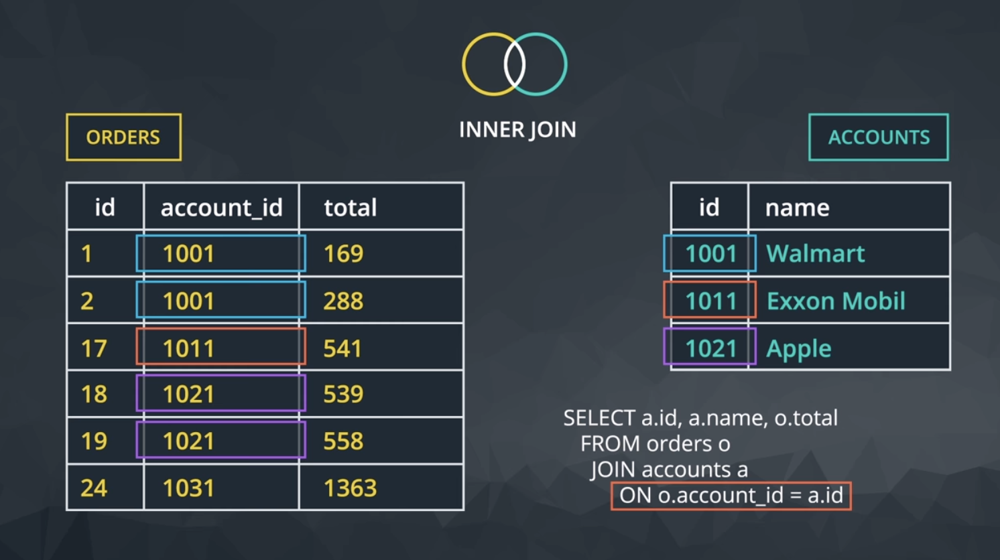

#### Database normalization (Key Concept)
When creating a database, it is really important to think about how data will be stored. This is known as normalization, and it is a huge part of most SQL classes. If you are in charge of setting up a new database, it is important to have a thorough understanding of database normalization.

There are essentially three ideas that are aimed at database normalization:

+ Are the tables storing logical groupings of the data?
+ Can I make changes in a single location, rather than in many tables for the same information?
+ Can I access and manipulate data quickly and efficiently?

Useful links:
+ https://www.guru99.com/database-normalization.html
+ https://www.studytonight.com/dbms/database-normalization.php
+ https://www.youtube.com/watch?v=l5DCnCzDb8g
+ https://towardsdatascience.com/database-normalization-explained-53e60a494495

#### Inner JOINS
If we wanted to only pull individual elements from either the orders or accounts table, we can do this by using the exact same information in the FROM and ON statements. However, in your SELECT statement, you will need to know how to specify tables and columns in the SELECT statement:

1. The table name is always before the period.
2. The column you want from that table is always after the period.

For example, if we want to pull only the account name and the dates in which that account placed an order, but none of the other columns, we can do this with the following query:
```
SELECT accounts.name, orders.occurred_at
FROM orders
JOIN accounts
ON orders.account_id = accounts.id;
```
The above query only pulls two columns, not all the information in these two tables. Alternatively, the below query pulls all the columns from both the accounts and orders table.
```
SELECT *
FROM orders
JOIN accounts
ON orders.account_id = accounts.id;
```

The below query pulls all the information from only the orders table:
```
SELECT orders.*
FROM orders
JOIN accounts
ON orders.account_id = accounts.id;
```
Joining tables allows you access to each of the tables in the SELECT statement through the table name, and the columns will always follow a . after the table name.

#### Entity Relationship Diagrams (ERD)


#### Keys
Primary Key (PK)
A primary key is a unique column in a particular table. This is the first column in each of our tables. Here, those columns are all called id, but that doesn't necessarily have to be the name. It is common that the primary key is the first column in our tables in most databases.

Foreign Key (FK)
A foreign key is a column in one table that is a primary key in a different table. We can see in the Parch & Posey ERD that the foreign keys are:

1. region_id
2. account_id
3. sales_rep_id

Each of these is linked to the primary key of another table.

#### Primary - Foreign Key Link


In the image you can see that:
1. The region_id is the foreign key.
The region_id is linked to id - this is the primary-foreign key link that connects these two tables.
2. The crow's foot shows that the FK can actually appear in many rows in the sales_reps table.
3. While the single line is telling us that the PK shows that id appears only once per row in this table.
4. If you look through the rest of the database, you will notice this is always the case for a primary-foreign key relationship.

+ Note: The way we join any two tables is in this way: linking the PK and FK (generally in an ON statement). We will ALWAYs have the PK equal to the FK when joining two tables.

#### Joining 3 tables
This same logic can actually assist in joining more than two tables together.
```
SELECT *
FROM web_events
JOIN accounts
ON web_events.account_id = accounts.id
JOIN orders
ON accounts.id = orders.account_id
```

Alternatively, we can create a SELECT statement that could pull specific columns from any of the three tables. Again, our JOIN holds a table, and ON is a link for our PK to equal the FK.

To pull specific columns, the SELECT statement will need to specify the table that you are wishing to pull the column from, as well as the column name. We could pull only three columns in the above by changing the select statement to the below, but maintaining the rest of the JOIN information:
```
SELECT web_events.channel, accounts.name, orders.total
```

#### Use alias for table and column names
When we JOIN tables together, it is nice to give each table an alias. Frequently an alias is just the first letter of the table name.

```
FROM tablename AS t1
JOIN tablename2 AS t2

   and

SELECT col1 + col2 AS total, col3
```

is __exactly__ same as:

```
FROM tablename t1
JOIN tablename2 t2

   and

SELECT col1 + col2 total, col3
```

* Note: While aliasing tables is the most common use case. It can also be used to alias the columns selected to have the resulting table reflect a more readable name.
```
SELECT t1.column1 aliasname, t2.column2 aliasname2
FROM tablename AS t1
JOIN tablename2 AS t2
```

#### JOIN Part-1 Quiz Answers:
+ Q1:
```
SELECT a.name, a.primary_poc poc, w.channel channel, w.occurred_at occurred_at
FROM accounts AS a
JOIN web_events AS w
ON w.account_id = a.id
WHERE a.name = 'Walmart'
;
```
+ Q2:
```
SELECT r.name region, s.name rep, a.name account
FROM region r
JOIN sales_reps s
ON r.id = s.region_id
JOIN accounts a
ON a.sales_rep_id = s.id
ORDER BY a.name ASC (Note: Ascending is the default sort so don't need to have it explicitly)
;
```
+ Q3
```
SELECT r.name region, a.name account, (o.total_amt_usd/(o.total + 0.01)) unit_price
FROM orders o
JOIN accounts a
ON a.id = o.account_id
JOIN sales_reps s
ON s.id = a.sales_rep_id
JOIN region r
ON r.id = s.region_id
;
```
* NOTE: traditional databases __do not__ allow for many-to-many relationships, as these break the schema down pretty quickly. See [here](https://stackoverflow.com/questions/7339143/why-no-many-to-many-relationships) for detailed discussion.
  + [Quora](https://www.quora.com/My-senior-told-me-to-avoid-many-to-many-relationships-in-database-design-when-possible-because-it-creates-complications-that-are-avoidable-He-had-a-hard-time-giving-concrete-examples-why-would-he-say-that)
  + [Dataversity](https://www.dataversity.net/more-database-design-errors-confusion-with-many-to-many-relationships/#)
  + [Reddit](https://www.reddit.com/r/Database/comments/al8rop/why_exactly_area_manytomany_relationships_bad/)
  + [dzone.com](https://dzone.com/articles/how-to-handle-a-many-to-many-relationship-in-datab)
  + [supportgroup.com](https://blog.supportgroup.com/getting-started-with-relational-databases-one-to-one-and-many-to-many-relationships)
  + [medium article](https://rstsaygili.medium.com/many-to-many-relationships-in-relational-databases-af867547914f)

#### Left and Right JOINs
For visualization of JOINs, use Venn diagrams where the cirlcles represent the tables.

+ Inner JOIN visualization:

  + here the yellow circle in the Venn diagram corresponds to the the Orders table; the green circle, Accounts table

+ Left, Right, and Outer JOINs visualization:

  + Note: If there is not matching information in the JOINed table, then you will have columns with empty cells. These empty cells introduce a new data type called NULL.

+ `PINS` Left and Right JOINS are interchangeable, depends on which table comes first in order to set up the data you want. See below:


  + The above two tables return the same results, we just changed the position of the Accounts table. In the LEFT JOIN (top) query, Accounts is the left table. In the RIGHT JOIN (bottom) query, Accounts is the right table. This works since Accounts table is the table that has the extra data set that is __not__ in the orders table and the intent of these queries is to get the data that is not found within both tables (e.g. results from an INNER JOIN).
  + As a general practice, we use `LEFT JOIN` since it is interchangeable with RIGHT JOIN. Just make sure that the table that has the extra data that you want to grab is in the left table position for the query.

#### Full Outer Join
This will return the inner join result set, as well as any unmatched rows from __either of the two tables being joined__.

Again this returns rows that do not match one another from the two tables. The use cases for a __full outer join are very rare__.

+ `FULL OUTER JOIN` is same as `OUTER JOIN` (e.g. they are synonymous)
+ [Full Outer Join Example](https://www.w3resource.com/sql/joins/perform-a-full-outer-join.php)


#### JOIN Part-2 Quiz Answers:
+ Q1:
```
SELECT r.name region, s.name salesrep, a.name account
FROM region r
JOIN sales_reps s
ON r.id = s.region_id
JOIN accounts a
ON s.id = a.sales_rep_id
WHERE r.name = 'Midwest'
ORDER BY a.name
;
```

+ Q2:
```
SELECT r.name region, s.name salesrep, a.name account
FROM region r
JOIN sales_reps s
ON r.id = s.region_id
JOIN accounts a
ON s.id = a.sales_rep_id
WHERE r.name = 'Midwest'
AND s.name LIKE 'S%'
ORDER BY a.name
;
```

+ Q3:
```
SELECT r.name region, s.name salesrep, a.name account
FROM region r
JOIN sales_reps s
ON r.id = s.region_id
JOIN accounts a
ON s.id = a.sales_rep_id
WHERE r.name = 'Midwest'
AND s.name LIKE '% K%'
ORDER BY a.name
;
```

+ Q4:
```
SELECT r.name region, a.name account, (o.total_amt_usd/(o.total+0.01)) unit_price
FROM region r
JOIN sales_reps s
ON r.id = s.region_id
JOIN accounts a
ON s.id = a.sales_rep_id
JOIN orders o
ON a.id = o.account_id
AND o.standard_qty > 100    // can use WHERE instead of AND in this last line to filter
```

+ Q5:


+ Q6:


+ Q7:


+ Q8:
